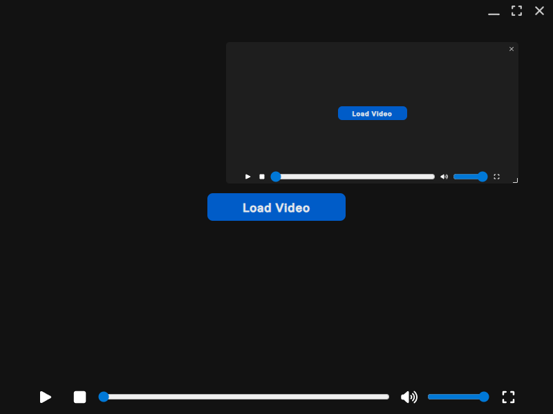

# Dual Video Player

## 🚀 About

Open source app for watching two videos at once. provides easy way to control both videos at once.

## 📷 Screenshots

  
  

## ⌨️ Keybinds

| Keyboard shortcut | Function |
| ------------------| -------- |
| <strong> space                    </strong>  | Play / Pause primary video             |
| <strong> ctrl + space             </strong>  | Play / Pause secondary video           |
| <strong> shift + space            </strong>  | Play / Pause both videos               |
| <strong> m                        </strong>  | Mute primary video                     |
| <strong> alt + m                  </strong>  | Mute secondary video                   |
| <strong> alt + ctrl + m           </strong>  | Mute both videos                       |
| <strong> f                        </strong>  | Toggle fullscreen primary video        |
| <strong> ctrl + f                 </strong>  | Toggle fullscreen secondary video      |
| <strong> &rarr;                   </strong>  | Seek forward by 15s in primary video   |
| <strong> ctrl + &rarr;            </strong>  | Seek forward by 60s in primary video   |
| <strong> alt + &rarr;             </strong>  | Seek forward by 15s in secondary video |
| <strong> ctrl + alt + &rarr;      </strong>  | Seek forward by 60s in secondary video |
| <strong> shift + &rarr;           </strong>  | Seek forward by 15s in both videos     |
| <strong> ctrl + shift + &rarr;    </strong>  | Seek forward by 60s in both videos     |
| <strong> &larr;                   </strong>  | Seek reverse by 15s in primary video   |
| <strong> ctrl + &larr;            </strong>  | Seek reverse by 60s in primary video   |
| <strong> alt + &larr;             </strong>  | Seek reverse by 15s in secondary video |
| <strong> ctrl + alt + &larr;      </strong>  | Seek reverse by 60s in secondary video |
| <strong> shift + &larr;           </strong>  | Seek reverse by 15s in both videos     |
| <strong> ctrl + shift + &larr;    </strong>  | Seek reverse by 60s in both videos     |
| <strong> &uarr;                   </strong>  | Volume up in primary video             |
| <strong> alt + &uarr;             </strong>  | Volume up in primarsecondary video     |
| <strong> shift +&uarr;            </strong>  | Volume up in both videos               |
| <strong> &darr;                   </strong>  | Volume up in primary video             |
| <strong> alt + &darr;             </strong>  | Volume up in primarsecondary video     |
| <strong> shift +&darr;            </strong>  | Volume up in both videos               |
| <strong> w                        </strong>  | Stop playing first video               |
| <strong> alt + w                  </strong>  | Stop playing second video              |
| <strong> alt + n                  </strong>  | Re-enable second video player          |